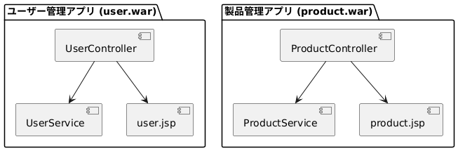
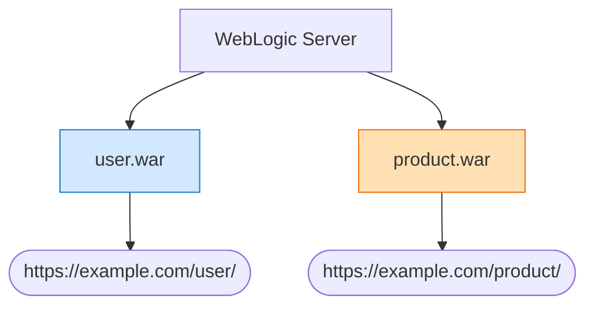
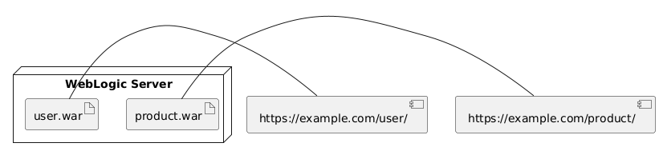
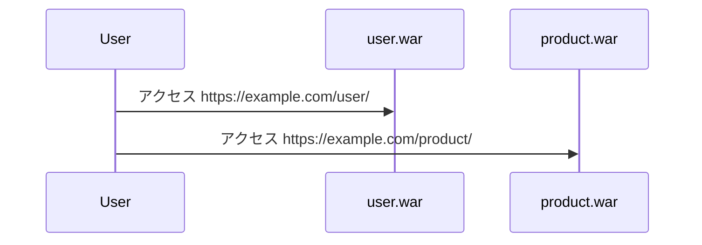
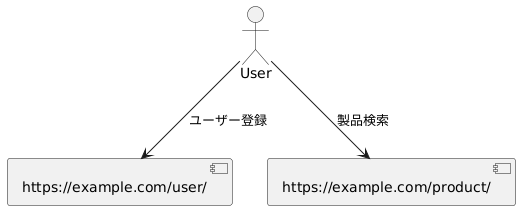

## アプリケーション構成概要

本システムは機能ごとに以下の2つのWARファイルに分割し、それぞれをWebLogicにデプロイしている。

| WAR名 | 機能 | URLエンドポイント |
|-------|------|--------------------|
| user.war | ユーザーの登録・認証・管理機能 | https://example.com/user/ |
| product.war | 製品情報の検索・登録・編集機能 | https://example.com/product/ |

```
@startuml
package "ユーザー管理アプリ (user.war)" {
  [UserController] --> [UserService]
  [UserController] --> [user.jsp]
}

package "製品管理アプリ (product.war)" {
  [ProductController] --> [ProductService]
  [ProductController] --> [product.jsp]
}
@enduml

```



### デプロイ構成
- WebLogicサーバ1台に2つのWARをデプロイ
- 各WARは独立して動作し、必要に応じてREST APIで連携する

以下に、WARごとの構成および全体のシステム構成を示す。


```
@startuml
node "WebLogic Server" {
  artifact "user.war" as UserWar
  artifact "product.war" as ProductWar
}

UserWar - [https://example.com/user/]
ProductWar - [https://example.com/product/]
@enduml

```



### システム構成図（リクエストフロー）

```
@startuml
actor User
User --> [https://example.com/user/] : ユーザー登録
User --> [https://example.com/product/] : 製品検索
@enduml
```
