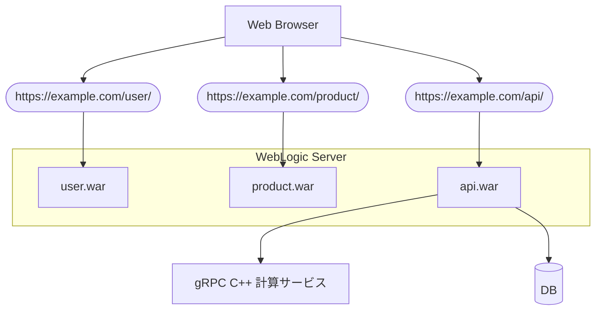
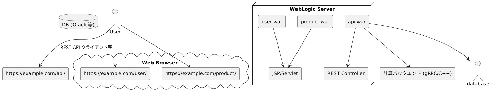
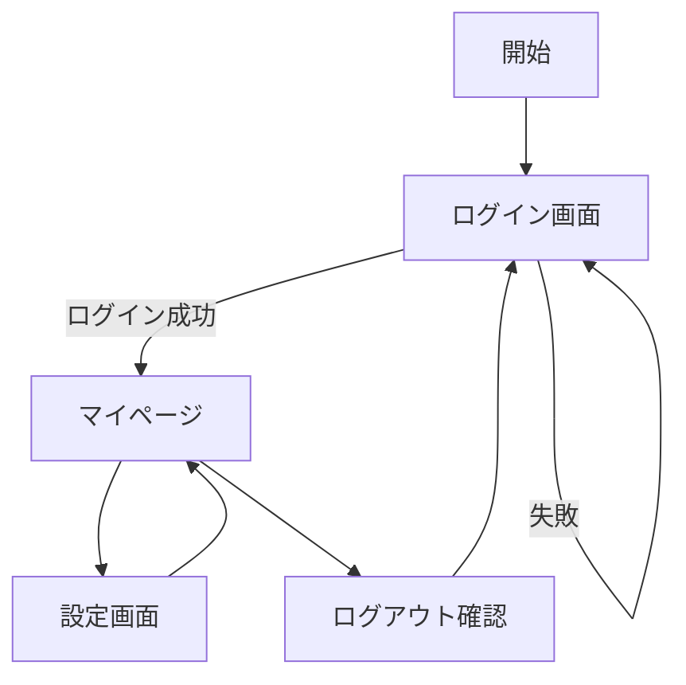
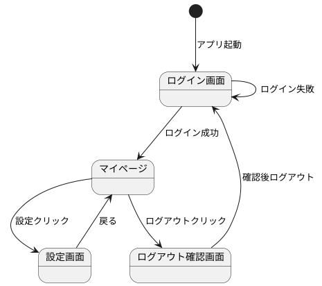
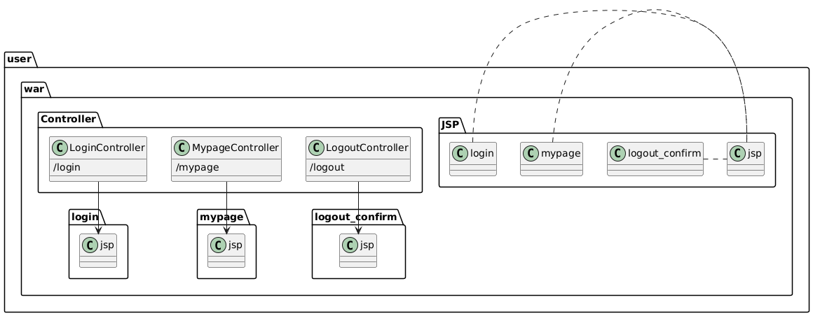
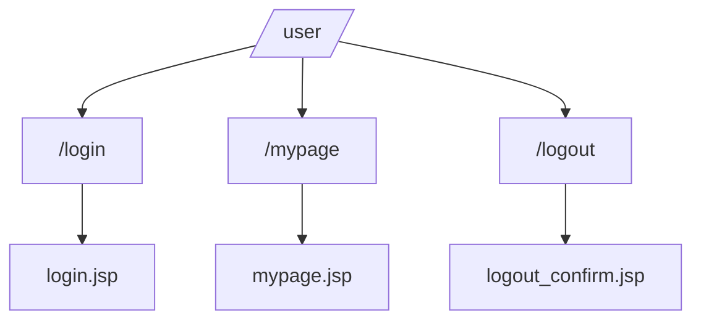

## システム構成

本システムは、3つのJavaアプリケーション（WARファイル）と、1つのC++製gRPCサービスで構成される。

### WAR構成

| WAR名 | 機能 | エンドポイント（URL） |
|-------|------|--------------------------|
| `user.war` | ユーザー管理画面とAPI | https://example.com/user/ |
| `product.war` | 製品管理画面とAPI | https://example.com/product/ |
| `api.war` | REST API（フロントなし） | https://example.com/api/ |

### gRPCバックエンド

- 計算用のバックエンドは C++ により実装され、gRPC を通じて `api.war` から呼び出される。
- 内部ネットワーク上で動作し、外部から直接アクセスされない。


```
@startuml
skinparam componentStyle rectangle

actor User

node "WebLogic Server" {
  [user.war] --> [JSP/Servlet]
  [product.war] --> [JSP/Servlet]
  [api.war] --> [REST Controller]
}

cloud "Web Browser" {
  User --> [https://example.com/user/]
  User --> [https://example.com/product/]
}

User --> [https://example.com/api/] : REST API クライアント等

database "DB (Oracle等)" {
}

[api.war] --> [計算バックエンド (gRPC/C++)]
[api.war] --> database
@enduml
```


## JSP画面遷移図

以下はユーザー管理モジュールにおける、主な画面遷移の概要である。

- ユーザーは `/login` にアクセスして認証を行い、成功すれば `/mypage` に遷移する。
- `/mypage` では設定画面 `/settings` への遷移や、ログアウト処理 `/logout` を行う。

### 画面遷移図（PlantUML）

```
@startuml
[*] --> ログイン画面 : アプリ起動

ログイン画面 --> マイページ : ログイン成功
ログイン画面 --> ログイン画面 : ログイン失敗

マイページ --> 設定画面 : 設定クリック
マイページ --> ログアウト確認画面 : ログアウトクリック
設定画面 --> マイページ : 戻る
ログアウト確認画面 --> ログイン画面 : 確認後ログアウト
@enduml

```



## URLパス構成図
以下は `user.war` 内の主要なパス構成である。

- `LoginController` → `/login`
- `MypageController` → `/mypage`
- `LogoutController` → `/logout`

### パス構成図
```
@startuml
package "user.war" {
  folder "Controller" {
    LoginController : /login
    MypageController : /mypage
    LogoutController : /logout
  }

  folder "JSP" {
    login.jsp
    mypage.jsp
    logout_confirm.jsp
  }

  LoginController --> login.jsp
  MypageController --> mypage.jsp
  LogoutController --> logout_confirm.jsp
}
@enduml
```



